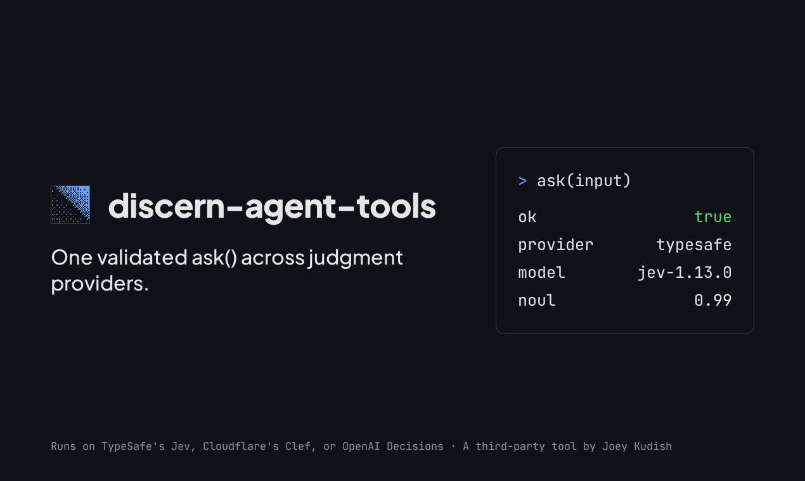

# Discern Agent Tools

[](https://github.com/jkudish/discern-agent-tools/actions/workflows/ci.yml)
[](LICENSE)

<p align="center">
  
</p>

Multi-provider judgment transport with fail-closed validation, used by [Discern Browser](https://github.com/jkudish/discern-browser) and [Discern MCP](https://github.com/jkudish/discern-mcp). It sends typed questions to TypeSafe's Jev model (directly or through OpenRouter, Cloudflare, or Vercel) or to OpenAI's Decisions API.

Formerly `@jkudish/jev-agent-tools`; see [Migrating from jev-agent-tools](#migrating-from-jev-agent-tools).

One `ask()` picks a carrier from the environment, sends your typed questions, and validates the answers before you see them. You get the answer plus usage and the effective model, or a typed rejection. It never throws a verdict at you. You can also build on it directly.

## Install

Requires Node.js 22 or newer.

```bash
npm install @jkudish/discern-agent-tools
```

## Result contract

`ask(input, config?)` returns `Promise<{ ok: true, answer, usage, model, provider } | { ok: false, code, message }>` and never throws a verdict. Every built-in carrier shares one HTTP path: it retries only 408, 409, 429, and 500-599, up to `config.maxAttempts` total attempts (default 3, clamped to 1-6), honoring `Retry-After` (capped at 5 s) or else a jittered exponential backoff. Network failures are never re-sent, because without an idempotency key a re-send can double-process a paid call. One `config.timeoutMs` deadline (default 60000) covers every attempt, and response bodies over 1,000,000 bytes are rejected while they stream. Transport failures return `request_failed` (the message includes the HTTP status, and for OpenRouter's token limit the code `max_tokens_exceeded`), `rate_limited` when 429 retries are exhausted, `unavailable` when 5xx retries are exhausted, or `timeout` when the deadline passes, and report the API's effective model rather than the requested alias; invalid responses return specific codes such as `refused` (the carrier declined a question), `answer_id_mismatch`, `invalid_distribution`, `invalid_noul`, `invalid_usage`, and `invalid_model`; configuration errors return `configuration_error`. Messages never include response bodies or credentials. The two consumers need different error behavior: discern-browser maps `!ok` to its own exception, while discern-mcp maps `!ok` to `invalid_response`.

```js
import { ask } from "@jkudish/discern-agent-tools";

const result = await ask({
  state: "A customer asks for a refund of a duplicate charge.",
  questions: { refund: { type: "noul", instructions: "Is a refund requested?" } },
  model: "latest",
  signal: new AbortController().signal,
});

if (!result.ok) console.error(result.code, result.message);
else console.log(result.answer.refund.noul, result.usage, result.model);
```

## Providers

Auto-selection tries them in this order:

- **TypeSafe** (`TYPESAFE_API_KEY`, optional `TYPESAFE_BASE_URL`): direct; sends the model you supply. The neutral `latest` alias maps to `jev-latest`.
- **OpenRouter** (`OPENROUTER_API_KEY`, begins `sk-or-`): maps `latest` and `jev-latest` to OpenRouter's moving `~typesafe/jev-latest` alias. `DISCERN_OPENROUTER_BASE_URL` overrides the API root. Pin a version, such as `typesafe/jev-1.13`, for reproducible routing. Results report the snapshot OpenRouter returns.
- **Cloudflare** (`DISCERN_CLOUDFLARE_API_TOKEN` preferred over `CLOUDFLARE_API_TOKEN`, plus `CLOUDFLARE_ACCOUNT_ID`, optional `DISCERN_CLOUDFLARE_BASE_URL`): maps `latest` and `jev-latest` to `typesafe/jev`.
  - The same carrier runs Cloudflare's own [Clef decision models](https://blog.cloudflare.com/clef-decision-models/): pass `clef` or `clef-flash` as the model (mapped to `@cf/cloudflare/clef` and `@cf/cloudflare/clef-flash`), or any `@cf/` model id unchanged. Clef uses the same request and answer format as Jev, so nothing is translated.
  - Clef is not Jev. It is a different model with its own calibration, so thresholds tuned on Jev need re-checking. `clef-flash` is the low-latency variant; expect occasional multi-second cold starts.
  - The token needs Workers AI access (Account → Workers AI → Read).
- **Vercel AI Gateway** (`AI_GATEWAY_API_KEY`, optional `DISCERN_VERCEL_ZERO_DATA_RETENTION`): selects `typesafe-ai/jev` unless given a `typesafe-ai/` model.
  - Set `DISCERN_VERCEL_ZERO_DATA_RETENTION=1` or `true` to request [Vercel's zero data retention (ZDR) routing](https://vercel.com/docs/ai-gateway/security-and-compliance/zdr) on every request.
  - Unset, empty, `0`, or `false` leaves the request body unchanged. Any other value is a configuration error before a request is sent.
  - Use `DISCERN_PROVIDER=vercel` when every judgment must use this restriction; auto-selection prefers other configured carriers, which ignore the setting.
  - Vercel offers per-request ZDR on Pro and Enterprise plans. It filters Gateway routes, including fallbacks, under Vercel and provider policies; review [the listed provider terms and exceptions](https://vercel.com/docs/ai-gateway/security-and-compliance/zdr#zdr-providers-and-policies). It does not control your application, MCP client, logs, browser artifacts, or other model providers.
- **OpenAI Decisions** (explicit only: `DISCERN_PROVIDER=openai`, with `DISCERN_OPENAI_API_KEY` preferred over `OPENAI_API_KEY`, optional `DISCERN_OPENAI_BASE_URL`): sends questions to [OpenAI's Decisions API](https://developers.openai.com/api/docs/guides/decisions) and maps `latest` and `jev-latest` to `gpt-6-luna`.
  - This is not Jev. It is a different model with its own calibration, so thresholds tuned on Jev need re-checking against your own labeled examples.
  - It is never auto-detected, because `OPENAI_API_KEY` is common in environments that never chose it.
  - Each noul is sent as a two-option choice over `true` and `false`, with its criteria as option descriptions; the noul is the weight on `true`. State is sent pretty-printed under a `State (JSON):` label, which costs about 35% more input tokens than compact JSON but agreed with Jev more often on captured requests. Limits: 255 choices, 10 score levels; requests above 200 questions are split into concurrent chunks.
  - The API is in public beta and may change before GA.

- **Any System One-compatible endpoint** (`DISCERN_API_KEY` and `DISCERN_API_BASE_URL`, the full POST URL): sends `{ model, state, questions }` with a Bearer token. Auto-selected only when no other carrier is configured. `latest` is sent as `jev-latest`; set another model name for endpoints that serve their own.

The neutral model alias `latest` means each carrier's current default model: Jev on TypeSafe, OpenRouter, Cloudflare, Vercel, and compatible endpoints, and `gpt-6-luna` on OpenAI. `jev-latest` keeps working.

Set `DISCERN_PROVIDER` to `typesafe`, `openrouter`, `cloudflare`, `vercel`, `compatible`, `openai`, or `auto` to select strictly. Unknown names and missing credentials fail rather than falling through; an empty value means `auto`. With no provider configured, the diagnostic names every supported credential variable. `config.env` accepts an injectable environment record, and `config.transport` accepts a run-bound transport for callers that own one. `config.onReply` receives the raw, unvalidated reply before validation, for callers that judge each answer on their own; treat it as untrusted input.

## Validation

Every reply is checked before you see it. Validation requires exactly the requested answer IDs and criterion IDs, finite probabilities in [0,1] summing to 1 within two-decimal rounding (0.5% per nonzero option, at least 1% and at most 5%), and a selected Choice maximum within a 0.001 tie tolerance. A score must agree with its distribution: either the probability-weighted mean of the level indices (within two-decimal rounding, so it can fall between levels) or the most likely level. A refused question yields `refused` and fails the whole call; callers that want per-question results split their questions. Noul values must be in [0,1], confidence finite or null, usage counters non-negative safe integers, and the effective model nonempty. An invalid answer yields `ok: false` before any usage is credited, so a malformed response can never become a decision.

## Adding a provider

The built-in list is a fixed, maintainer-curated set, currently: TypeSafe, OpenRouter, Cloudflare, Vercel, compatible endpoints, and OpenAI (explicit only). PRs that add a new built-in carrier are generally not accepted unless sufficient demand is shown. If you want support for a new provider, the supported path is a third-party driver package. I will accept PRs that link third-party providers from the READMEs of this package, [discern-browser](https://github.com/jkudish/discern-browser), and [discern-mcp](https://github.com/jkudish/discern-mcp).

### No code: inject a transport

`ask(input, { transport })` accepts any `DiscernTransport`: a `name` and an `ask(input)` returning `{ answers, usage, model }`. The validator checks the reply exactly as it checks a built-in carrier. The name is untrusted, so it never appears in error text.

```ts
import { ask, type DiscernTransport } from "@jkudish/discern-agent-tools";

const myGateway: DiscernTransport = {
  name: "my-gateway",
  async ask({ state, questions, model, signal }) {
    const response = await fetch("https://gw.example.com/v1/systemone", {
      method: "POST",
      headers: { authorization: `Bearer ${process.env.MY_GATEWAY_KEY}`, "content-type": "application/json" },
      body: JSON.stringify({ model, state, questions }),
      signal,
    });
    if (!response.ok) throw new Error(`upstream ${response.status}`);
    const body = await response.json();
    return {
      answers: body.answers,
      usage: { input_tokens: body.usage.input_tokens, output_tokens: body.usage.output_tokens },
      model: body.model,
    };
  },
};

const result = await ask(input, { transport: myGateway });
```

[Discern Browser](https://github.com/jkudish/discern-browser) exposes the same injection as `NavigateOptions.transport`. [Discern MCP](https://github.com/jkudish/discern-mcp) reaches any System One-compatible endpoint with `DISCERN_PROVIDER=compatible`, no code needed.

### Publish a third-party driver package

Wrap your carrier in a small npm package that exports a factory, so callers keep their credentials in their own environment:

```ts
import { ask } from "@jkudish/discern-agent-tools";
import { createRequestyTransport } from "@example/requesty-discern-driver";

const result = await ask(input, { transport: createRequestyTransport(process.env) });
```

A driver package exports a factory that returns a `DiscernTransport`: a `name`, and an `ask` that returns `{ answers, usage, model }`. Document the credential environment variables it reads, map `latest` to the model id your carrier serves, and keep error messages free of response bodies and credentials. Validation still happens here, so a malformed reply from your carrier can never become a decision.

Published a driver package? Open an issue or pull request on any of the three repositories and it will be linked from that README's provider section.

### Adding a built-in carrier

The built-ins are a fixed, maintainer-curated set (TypeSafe, OpenRouter, Cloudflare, Vercel, compatible endpoints, OpenAI). New built-ins are generally not accepted unless sufficient demand is shown; open an issue first. The mechanics, for when one is accepted:

- Add `src/transports/<name>.ts` exporting a driver: `name`, `isConfigured(env)`, `assertConfigured(env)`, and `create(env)` returning a `DiscernTransport`.
- Register it in the `drivers` array in `src/provider.ts`, and add its name to the `BuiltinDriver` name union. Pick its auto-detection position deliberately; the order is the documented precedence.
- Map `latest` (and `jev-latest`, for Jev carriers) to the model id the carrier actually serves, like the OpenRouter and Cloudflare mappings above.
- Use `postJson` from `src/transports/http.ts` for the request, so the carrier gets the shared retry, size, and error rules.
- Throw fixed-string errors only. The registry forwards only its own fixed messages (unknown `DISCERN_PROVIDER`, the no-credentials diagnostic, `DISCERN_PROVIDER=` errors, the Vercel ZDR value error, and `JEV_`/`DISCERN_` conflicts); anything else is replaced by a generic message. Never include response bodies.
- Add hermetic tests against a stubbed endpoint. A live smoke behind a real key is welcome but optional.

### Consumer-side wiring

Both consumers get every carrier, retry rule, and deadline from this package, so a new built-in carrier reaches discern-browser and discern-mcp with a version bump. discern-mcp passes its `DISCERN_MCP_REQUEST_TIMEOUT_MS` and `DISCERN_MCP_MAX_ATTEMPTS` settings through `timeoutMs` and `maxAttempts`.

## Also in the family

- [Discern Browser](https://github.com/jkudish/discern-browser) gives an agent a task and a URL and lets the judgment model pick the actions. The npm package is [@jkudish/discern-browser](https://www.npmjs.com/package/@jkudish/discern-browser).
- [Discern MCP](https://github.com/jkudish/discern-mcp) exposes the same judgments as MCP tools your agent can call anywhere. The npm package is [@jkudish/discern-mcp](https://www.npmjs.com/package/@jkudish/discern-mcp).

## Migrating from jev-agent-tools

1.0.0 renames the package and adds the OpenAI carrier and Cloudflare's Clef models. Smaller behavior changes are listed in the [changelog](CHANGELOG.md): fractional and stricter score validation, the `refused` rejection code, an empty `DISCERN_PROVIDER` meaning `auto`, and the OpenRouter attribution title.

- Install `@jkudish/discern-agent-tools` and update imports. `@jkudish/jev-agent-tools` is deprecated and receives no further releases.
- Rename environment variables from `JEV_<X>` to `DISCERN_<X>`. Through 1.x the old names still work: a `JEV_` value is used when its `DISCERN_` counterpart is unset or empty, and two different non-empty values are a configuration error that names both variables. `JEV_` names stop working in 2.0.

  | Before | After |
  | --- | --- |
  | `JEV_PROVIDER` | `DISCERN_PROVIDER` |
  | `JEV_CLOUDFLARE_API_TOKEN` | `DISCERN_CLOUDFLARE_API_TOKEN` |
  | `JEV_VERCEL_ZERO_DATA_RETENTION` | `DISCERN_VERCEL_ZERO_DATA_RETENTION` |
  | `JEV_OPENROUTER_BASE_URL`, `JEV_CLOUDFLARE_BASE_URL` | `DISCERN_OPENROUTER_BASE_URL`, `DISCERN_CLOUDFLARE_BASE_URL` |
  | `JEV_API_KEY`, `JEV_API_BASE_URL` | `DISCERN_API_KEY`, `DISCERN_API_BASE_URL` |

  Only the variables in `DISCERN_ENV_NAMES` are aliased; other `JEV_*` variables are ignored.

- Rename types: `JevTransport`, `JevTransportInput`, `JevTransportReply`, and `JevAnswer` become `DiscernTransport`, `DiscernTransportInput`, `DiscernTransportReply`, and `DiscernAnswer`. The old names remain as deprecated aliases until 2.0.
- Error messages say `Discern provider <name>` instead of `Jev provider <name>`. Match on `code`, which is unchanged, rather than on message text.
- `normalizeDiscernEnv(env, names?)` is exported for applications that read their own `DISCERN_` variables. Pass `[...DISCERN_ENV_NAMES, ...yourNames]`; a name ending in `_` covers a prefix family such as `PASSWORD_`. It returns a copy with legacy values filled in and the list of legacy names used, so you can print a deprecation warning, and never changes its input.

Model names are unchanged: `jev-latest` and pinned versions such as `jev-1.13` still name TypeSafe's Jev model. New code can use the neutral `latest`.
- `compatible` (the generic System One endpoint) and the OpenRouter and Cloudflare base URL overrides moved here from discern-mcp.

## Sponsoring

If you find Discern Agent Tools useful, consider becoming a [sponsor](https://github.com/sponsors/jkudish) or [donating](https://stripe.com/@jkudish).

## Development

```bash
npm install
npm run build
npm test            # hermetic tests, no API key needed
npm run test:live   # one real judgment per configured carrier; TYPESAFE_API_KEY and/or OPENAI_API_KEY
```

See [CONTRIBUTING.md](CONTRIBUTING.md). To report a vulnerability, see [SECURITY.md](SECURITY.md).

## License

[MIT](LICENSE)
